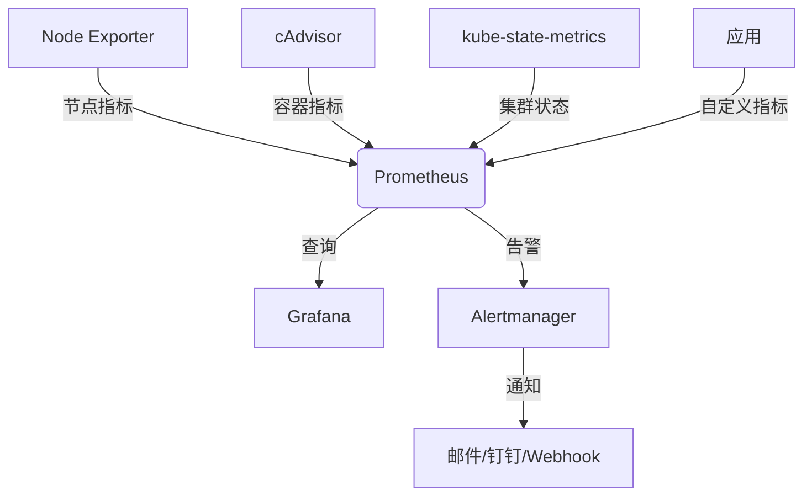

# 容器监控方案设计

## 1. 概述
本方案基于Prometheus Operator实现Kubernetes集群的容器监控，主要监控以下方面：
- 容器资源使用情况（CPU、内存、网络、磁盘）
- 应用性能指标
- 集群健康状态
- 告警通知

## 2. 架构设计

### 2.1 核心组件
- **Prometheus Operator**：自动化管理Prometheus实例
- **Prometheus**：指标收集与存储
- **Alertmanager**：告警管理
- **Grafana**：可视化展示
- **kube-state-metrics**：集群状态指标
- **node-exporter**：节点资源指标
- **cAdvisor**：容器资源监控

### 2.2 数据流
1. 各Pod通过/metrics接口暴露指标
2. Prometheus定期抓取指标数据
3. 数据存储到TSDB
4. Grafana从Prometheus查询数据展示
5. 告警规则触发后发送到Alertmanager

### 2.3 架构图


## 3. 部署方案

### 3.1 前置条件
- Kubernetes集群（本方案使用minikube）
- Helm包管理工具
- 持久化存储配置

### 3.2 部署步骤
1. 安装Prometheus Operator
```bash
helm repo add prometheus-community https://prometheus-community.github.io/helm-charts
helm install prometheus-operator prometheus-community/kube-prometheus-stack
```

2. 配置ServiceMonitor
```yaml
apiVersion: monitoring.coreos.com/v1
kind: ServiceMonitor
metadata:
  name: alert-manager
  namespace: monitoring
  labels:
    release: prometheus
spec:
  selector:
    matchLabels:
      app: alert-manager
  namespaceSelector:
    matchNames:
    - monitoring
  endpoints:
  - port: http
    interval: 30s
    path: /metrics
    scheme: http
```

3. 配置告警规则
```yaml
apiVersion: monitoring.coreos.com/v1
kind: PrometheusRule
metadata:
  name: alert-rules
  namespace: monitoring
spec:
  groups:
  - name: resource-usage
    rules:
    - alert: HighCPUUsage
      expr: sum(rate(container_cpu_usage_seconds_total[5m])) by (pod) > 0.8
      for: 5m
      labels:
        severity: critical
      annotations:
        summary: "High CPU usage detected"
        description: "Pod {{ $labels.pod }} CPU usage is over 80% for 5 minutes"
```

4. 配置Grafana仪表盘
- 导入官方Kubernetes监控仪表盘
- 自定义应用监控仪表盘

## 4. 监控指标

### 4.1 基础指标
- **CPU**：container_cpu_usage_seconds_total
- **内存**：container_memory_usage_bytes
- **网络**：container_network_receive_bytes_total
- **磁盘**：container_fs_usage_bytes

### 4.2 应用指标
- HTTP请求量：http_requests_total
- 请求延迟：http_request_duration_seconds
- 错误率：http_requests_failed_total

### 4.3 集群指标
- 节点状态：kube_node_status_condition
- Pod状态：kube_pod_status_phase
- 部署状态：kube_deployment_status_replicas

## 5. 告警策略

### 5.1 资源告警
- CPU使用率 > 80% 持续5分钟
- 内存使用率 > 90% 持续5分钟
- 磁盘使用率 > 85% 持续10分钟

### 5.2 应用告警
- HTTP错误率 > 5% 持续2分钟
- 请求延迟 > 1s 持续5分钟
- 服务不可用 > 1分钟

### 5.3 通知渠道
- 邮件通知
- 钉钉机器人
- Webhook集成

## 6. 维护方案

### 6.1 数据管理
- Prometheus数据保留策略：30天
- 定期备份TSDB数据
- 配置数据压缩

### 6.2 监控组件维护
- 定期检查组件健康状态
- 配置资源限制
- 设置自动扩缩容策略

### 6.3 版本管理
- 定期更新Prometheus Operator
- 测试新版本兼容性
- 制定回滚方案

## 7. 性能优化

### 7.1 采集优化
- 动态调整采集间隔
- 优化PromQL查询
- 使用Recording Rules
- 实现分片采集
- 配置采集优先级

### 7.2 存储优化
- 配置TSDB压缩
- 使用远程存储（Thanos/Cortex）
- 优化索引存储
- 实现数据分层存储
- 配置数据生命周期管理

### 7.3 自动扩缩容
- 基于CPU/内存使用率自动扩缩容
- 基于采集指标数量动态调整
- 配置HPA策略
- 设置资源上下限
- 实现零停机扩容
>>>>>>> REPLACE>

# 容器监控方案设计

## 1. 概述
本方案基于Prometheus Operator实现Kubernetes集群的容器监控，主要监控以下方面：
- 容器资源使用情况（CPU、内存、网络、磁盘）
- 应用性能指标
- 集群健康状态
- 告警通知

## 2. 架构设计

### 2.1 核心组件
- **Prometheus Operator**：自动化管理Prometheus实例
- **Prometheus**：指标收集与存储
- **Alertmanager**：告警管理
- **Grafana**：可视化展示
- **kube-state-metrics**：集群状态指标
- **node-exporter**：节点资源指标
- **cAdvisor**：容器资源监控

### 2.2 数据流
1. 各Pod通过/metrics接口暴露指标
2. Prometheus定期抓取指标数据
3. 数据存储到TSDB
4. Grafana从Prometheus查询数据展示
5. 告警规则触发后发送到Alertmanager

### 2.3 架构图


## 3. 部署方案

### 3.1 前置条件
- Kubernetes集群（本方案使用minikube）
- Helm包管理工具
- 持久化存储配置

### 3.2 部署步骤
1. 安装Prometheus Operator
```bash
helm repo add prometheus-community https://prometheus-community.github.io/helm-charts
helm install prometheus-operator prometheus-community/kube-prometheus-stack
```

2. 配置ServiceMonitor
```yaml
apiVersion: monitoring.coreos.com/v1
kind: ServiceMonitor
metadata:
  name: alert-manager
  namespace: monitoring
  labels:
    release: prometheus
spec:
  selector:
    matchLabels:
      app: alert-manager
  namespaceSelector:
    matchNames:
    - monitoring
  endpoints:
  - port: http
    interval: 30s
    path: /metrics
    scheme: http
```

3. 配置告警规则
```yaml
apiVersion: monitoring.coreos.com/v1
kind: PrometheusRule
metadata:
  name: alert-rules
  namespace: monitoring
spec:
  groups:
  - name: resource-usage
    rules:
    - alert: HighCPUUsage
      expr: sum(rate(container_cpu_usage_seconds_total[5m])) by (pod) > 0.8
      for: 5m
      labels:
        severity: critical
      annotations:
        summary: "High CPU usage detected"
        description: "Pod {{ $labels.pod }} CPU usage is over 80% for 5 minutes"
```

4. 配置Grafana仪表盘
- 导入官方Kubernetes监控仪表盘
- 自定义应用监控仪表盘

## 4. 监控指标

### 4.1 基础指标
- **CPU**：container_cpu_usage_seconds_total
- **内存**：container_memory_usage_bytes
- **网络**：container_network_receive_bytes_total
- **磁盘**：container_fs_usage_bytes

### 4.2 应用指标
- HTTP请求量：http_requests_total
- 请求延迟：http_request_duration_seconds
- 错误率：http_requests_failed_total

### 4.3 集群指标
- 节点状态：kube_node_status_condition
- Pod状态：kube_pod_status_phase
- 部署状态：kube_deployment_status_replicas

## 5. 告警策略

### 5.1 资源告警
- CPU使用率 > 80% 持续5分钟
- 内存使用率 > 90% 持续5分钟
- 磁盘使用率 > 85% 持续10分钟
- 网络带宽使用率 > 75% 持续5分钟
- 文件描述符使用率 > 80% 持续5分钟

### 5.2 应用告警
- HTTP错误率 > 5% 持续2分钟
- 请求延迟 > 1s 持续5分钟
- 服务不可用 > 1分钟
- 数据库连接数 > 90% 持续5分钟
- 消息队列积压 > 1000 持续10分钟

### 5.3 告警管理
- 告警分级（P0/P1/P2/P3）
- 告警抑制规则
- 告警静默配置
- 告警聚合策略
- 告警自愈机制

### 5.4 通知渠道
- 邮件通知
- 钉钉机器人
- Webhook集成
- 短信通知
- 电话告警
>>>>>>> REPLACE>

# 容器监控方案设计

## 1. 概述
本方案基于Prometheus Operator实现Kubernetes集群的容器监控，主要监控以下方面：
- 容器资源使用情况（CPU、内存、网络、磁盘）
- 应用性能指标
- 集群健康状态
- 告警通知

## 2. 架构设计

### 2.1 核心组件
- **Prometheus Operator**：自动化管理Prometheus实例
- **Prometheus**：指标收集与存储
- **Alertmanager**：告警管理
- **Grafana**：可视化展示
- **kube-state-metrics**：集群状态指标
- **node-exporter**：节点资源指标
- **cAdvisor**：容器资源监控

### 2.2 数据流
1. 各Pod通过/metrics接口暴露指标
2. Prometheus定期抓取指标数据
3. 数据存储到TSDB
4. Grafana从Prometheus查询数据展示
5. 告警规则触发后发送到Alertmanager

### 2.3 架构图


## 3. 部署方案

### 3.1 前置条件
- Kubernetes集群（本方案使用minikube）
- Helm包管理工具
- 持久化存储配置

### 3.2 部署步骤
1. 安装Prometheus Operator
```bash
helm repo add prometheus-community https://prometheus-community.github.io/helm-charts
helm install prometheus-operator prometheus-community/kube-prometheus-stack
```

2. 配置ServiceMonitor
```yaml
apiVersion: monitoring.coreos.com/v1
kind: ServiceMonitor
metadata:
  name: alert-manager
  namespace: monitoring
  labels:
    release: prometheus
spec:
  selector:
    matchLabels:
      app: alert-manager
  namespaceSelector:
    matchNames:
    - monitoring
  endpoints:
  - port: http
    interval: 30s
    path: /metrics
    scheme: http
```

3. 配置告警规则
```yaml
apiVersion: monitoring.coreos.com/v1
kind: PrometheusRule
metadata:
  name: alert-rules
  namespace: monitoring
spec:
  groups:
  - name: resource-usage
    rules:
    - alert: HighCPUUsage
      expr: sum(rate(container_cpu_usage_seconds_total[5m])) by (pod) > 0.8
      for: 5m
      labels:
        severity: critical
      annotations:
        summary: "High CPU usage detected"
        description: "Pod {{ $labels.pod }} CPU usage is over 80% for 5 minutes"
```

4. 配置Grafana仪表盘
- 导入官方Kubernetes监控仪表盘
- 自定义应用监控仪表盘

## 4. 监控指标

### 4.1 基础指标
- **CPU**：container_cpu_usage_seconds_total
- **内存**：container_memory_usage_bytes
- **网络**：container_network_receive_bytes_total
- **磁盘**：container_fs_usage_bytes
- **GPU**：nvidia_gpu_duty_cycle
- **IO**：container_fs_reads_bytes_total

### 4.2 应用指标
- HTTP请求量：http_requests_total
- 请求延迟：http_request_duration_seconds
- 错误率：http_requests_failed_total
- 数据库连接数：db_connections_total
- 缓存命中率：cache_hits_total
- 消息队列积压：queue_backlog_total

### 4.3 集群指标
- 节点状态：kube_node_status_condition
- Pod状态：kube_pod_status_phase
- 部署状态：kube_deployment_status_replicas
- 服务状态：kube_service_status_load_balancer_ingress
- 存储状态：kube_persistentvolume_status_phase
- 网络策略：kube_networkpolicy_status

### 4.4 自定义指标
- 业务成功率：business_success_rate
- 订单处理量：order_processed_total
- 用户活跃度：user_activity_total
- API调用量：api_calls_total
- 支付成功率：payment_success_rate
>>>>>>> REPLACE>

# 容器监控方案设计

## 1. 概述
本方案基于Prometheus Operator实现Kubernetes集群的容器监控，主要监控以下方面：
- 容器资源使用情况（CPU、内存、网络、磁盘）
- 应用性能指标
- 集群健康状态
- 告警通知

## 2. 架构设计

### 2.1 核心组件
- **Prometheus Operator**：自动化管理Prometheus实例
- **Prometheus**：指标收集与存储
- **Alertmanager**：告警管理
- **Grafana**：可视化展示
- **kube-state-metrics**：集群状态指标
- **node-exporter**：节点资源指标
- **cAdvisor**：容器资源监控

### 2.2 数据流
1. 各Pod通过/metrics接口暴露指标
2. Prometheus定期抓取指标数据
3. 数据存储到TSDB
4. Grafana从Prometheus查询数据展示
5. 告警规则触发后发送到Alertmanager

### 2.3 架构图


## 3. 部署方案

### 3.1 前置条件
- Kubernetes集群（本方案使用minikube）
- Helm包管理工具
- 持久化存储配置

### 3.2 部署步骤
1. 安装Prometheus Operator
```bash
helm repo add prometheus-community https://prometheus-community.github.io/helm-charts
helm install prometheus-operator prometheus-community/kube-prometheus-stack
```

2. 配置ServiceMonitor
```yaml
apiVersion: monitoring.coreos.com/v1
kind: ServiceMonitor
metadata:
  name: alert-manager
  namespace: monitoring
  labels:
    release: prometheus
spec:
  selector:
    matchLabels:
      app: alert-manager
  namespaceSelector:
    matchNames:
    - monitoring
  endpoints:
  - port: http
    interval: 30s
    path: /metrics
    scheme: http
```

3. 配置告警规则
```yaml
apiVersion: monitoring.coreos.com/v1
kind: PrometheusRule
metadata:
  name: alert-rules
  namespace: monitoring
spec:
  groups:
  - name: resource-usage
    rules:
    - alert: HighCPUUsage
      expr: sum(rate(container_cpu_usage_seconds_total[5m])) by (pod) > 0.8
      for: 5m
      labels:
        severity: critical
      annotations:
        summary: "High CPU usage detected"
        description: "Pod {{ $labels.pod }} CPU usage is over 80% for 5 minutes"
```

4. 配置Grafana仪表盘
- 导入官方Kubernetes监控仪表盘
- 自定义应用监控仪表盘

## 4. 监控指标

### 4.1 基础指标
- **CPU**：container_cpu_usage_seconds_total
- **内存**：container_memory_usage_bytes
- **网络**：container_network_receive_bytes_total
- **磁盘**：container_fs_usage_bytes

### 4.2 应用指标
- HTTP请求量：http_requests_total
- 请求延迟：http_request_duration_seconds
- 错误率：http_requests_failed_total

### 4.3 集群指标
- 节点状态：kube_node_status_condition
- Pod状态：kube_pod_status_phase
- 部署状态：kube_deployment_status_replicas

## 5. 告警策略

### 5.1 资源告警
- CPU使用率 > 80% 持续5分钟
- 内存使用率 > 90% 持续5分钟
- 磁盘使用率 > 85% 持续10分钟

### 5.2 应用告警
- HTTP错误率 > 5% 持续2分钟
- 请求延迟 > 1s 持续5分钟
- 服务不可用 > 1分钟

### 5.3 通知渠道
- 邮件通知
- 钉钉机器人
- Webhook集成

## 6. 维护方案

### 6.1 数据管理
- Prometheus数据保留策略：30天
- 定期备份TSDB数据
- 配置数据压缩

### 6.2 监控组件维护
- 定期检查组件健康状态
- 配置资源限制
- 设置自动扩缩容策略

### 6.3 版本管理
- 定期更新Prometheus Operator
- 测试新版本兼容性
- 制定回滚方案

## 7. 性能优化

### 7.1 采集优化
- 调整采集间隔
- 优化PromQL查询
- 使用Recording Rules

### 7.2 存储优化
- 配置TSDB压缩
- 使用远程存储
- 优化索引存储

## 8. 安全方案

### 8.1 访问控制
- 配置RBAC权限
- 启用TLS加密
- 限制API访问

### 8.2 数据安全
- 配置数据加密
- 定期备份
- 监控数据访问日志

## 9. 可视化方案

### 9.1 Grafana仪表盘
- 预定义仪表盘
  - Kubernetes集群概览
  - 节点资源使用
  - Pod资源使用
  - 应用性能监控
  - 网络拓扑视图
  - 存储性能分析
- 自定义仪表盘
  - 业务指标展示
  - 告警趋势分析
  - 历史数据对比
  - 实时数据流
  - 预测分析

### 9.2 报表系统
- 每日/周/月报表
- 性能趋势分析
- 异常事件统计
- SLA报告
- 容量预测报告

### 9.3 可视化增强
- 实时数据流展示
- 拓扑图可视化
- 告警热力图
- 历史数据对比
- 预测分析图表
# 容器监控方案设计

## 1. 概述
本方案基于Prometheus Operator实现Kubernetes集群的容器监控，主要监控以下方面：
- 容器资源使用情况（CPU、内存、网络、磁盘）
- 应用性能指标
- 集群健康状态
- 告警通知

## 2. 架构设计

### 2.1 核心组件
- **Prometheus Operator**：自动化管理Prometheus实例
- **Prometheus**：指标收集与存储
- **Alertmanager**：告警管理
- **Grafana**：可视化展示
- **kube-state-metrics**：集群状态指标
- **node-exporter**：节点资源指标
- **cAdvisor**：容器资源监控

### 2.2 数据流
1. 各Pod通过/metrics接口暴露指标
2. Prometheus定期抓取指标数据
3. 数据存储到TSDB
4. Grafana从Prometheus查询数据展示
5. 告警规则触发后发送到Alertmanager

### 2.3 架构图


## 3. 部署方案

### 3.1 前置条件
- Kubernetes集群（本方案使用minikube）
- Helm包管理工具
- 持久化存储配置

### 3.2 部署步骤
1. 安装Prometheus Operator
```bash
helm repo add prometheus-community https://prometheus-community.github.io/helm-charts
helm install prometheus-operator prometheus-community/kube-prometheus-stack
```

2. 配置ServiceMonitor
```yaml
apiVersion: monitoring.coreos.com/v1
kind: ServiceMonitor
metadata:
  name: alert-manager
  namespace: monitoring
  labels:
    release: prometheus
spec:
  selector:
    matchLabels:
      app: alert-manager
  namespaceSelector:
    matchNames:
    - monitoring
  endpoints:
  - port: http
    interval: 30s
    path: /metrics
    scheme: http
```

3. 配置告警规则
```yaml
apiVersion: monitoring.coreos.com/v1
kind: PrometheusRule
metadata:
  name: alert-rules
  namespace: monitoring
spec:
  groups:
  - name: resource-usage
    rules:
    - alert: HighCPUUsage
      expr: sum(rate(container_cpu_usage_seconds_total[5m])) by (pod) > 0.8
      for: 5m
      labels:
        severity: critical
      annotations:
        summary: "High CPU usage detected"
        description: "Pod {{ $labels.pod }} CPU usage is over 80% for 5 minutes"
```

4. 配置Grafana仪表盘
- 导入官方Kubernetes监控仪表盘
- 自定义应用监控仪表盘

## 4. 监控指标

### 4.1 基础指标
- **CPU**：container_cpu_usage_seconds_total
- **内存**：container_memory_usage_bytes
- **网络**：container_network_receive_bytes_total
- **磁盘**：container_fs_usage_bytes

### 4.2 应用指标
- HTTP请求量：http_requests_total
- 请求延迟：http_request_duration_seconds
- 错误率：http_requests_failed_total

### 4.3 集群指标
- 节点状态：kube_node_status_condition
- Pod状态：kube_pod_status_phase
- 部署状态：kube_deployment_status_replicas

## 5. 告警策略

### 5.1 资源告警
- CPU使用率 > 80% 持续5分钟
- 内存使用率 > 90% 持续5分钟
- 磁盘使用率 > 85% 持续10分钟

### 5.2 应用告警
- HTTP错误率 > 5% 持续2分钟
- 请求延迟 > 1s 持续5分钟
- 服务不可用 > 1分钟

### 5.3 通知渠道
- 邮件通知
- 钉钉机器人
- Webhook集成

## 6. 维护方案

### 6.1 数据管理
- Prometheus数据保留策略：30天
- 定期备份TSDB数据
- 配置数据压缩

### 6.2 监控组件维护
- 定期检查组件健康状态
- 配置资源限制
- 设置自动扩缩容策略

### 6.3 版本管理
- 定期更新Prometheus Operator
- 测试新版本兼容性
- 制定回滚方案

## 7. 性能优化

### 7.1 采集优化
- 调整采集间隔
- 优化PromQL查询
- 使用Recording Rules

### 7.2 存储优化
- 配置TSDB压缩
- 使用远程存储
- 优化索引存储

## 8. 安全方案

### 8.1 访问控制
- 配置RBAC权限
- 启用TLS加密
- 限制API访问

### 8.2 数据安全
- 配置数据加密
- 定期备份
- 监控数据访问日志

## 9. 可视化方案

### 9.1 Grafana仪表盘
- 预定义仪表盘
  - Kubernetes集群概览
  - 节点资源使用
  - Pod资源使用
  - 应用性能监控
- 自定义仪表盘
  - 业务指标展示
  - 告警趋势分析
  - 历史数据对比

### 9.2 报表系统
- 每日/周/月报表
- 性能趋势分析
- 异常事件统计

## 10. 性能与容量规划

### 10.1 性能测试
- 单Prometheus实例采集能力
- 存储性能基准测试
- 查询性能优化

### 10.2 容量规划
- 数据存储容量估算
- 采集频率优化
- 集群规模扩展方案

## 11. 灾难恢复

### 11.1 备份策略
- Prometheus数据备份
- 告警规则备份
- Grafana配置备份

### 11.2 恢复方案
- 数据恢复流程
- 组件故障恢复
- 集群级灾难恢复

## 12. 多集群监控

### 12.1 架构设计
- 中心化Prometheus
- 联邦集群方案
- 跨集群告警管理

### 12.2 数据聚合
- 全局指标视图
- 跨集群告警
- 统一监控门户
