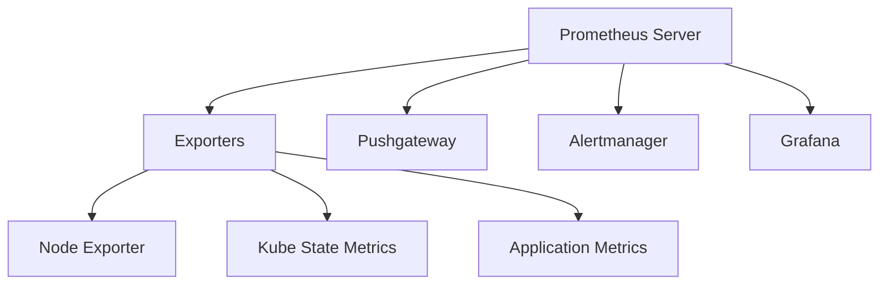

# 容器监控教程

## 1. Prometheus 简介

Prometheus 是一个开源的系统监控和报警工具包，特别适合容器化环境。主要特点包括：

- 多维数据模型（时间序列由 metric 名称和键/值对标识）
- 灵活的查询语言 PromQL
- 不依赖分布式存储，单个服务器节点是自治的
- 通过 HTTP 拉取方式收集时间序列数据
- 支持通过中间网关推送时间序列数据
- 通过服务发现或静态配置发现目标
- 多种图形和仪表板支持

## 2. Prometheus 架构



## 3. 关键监控指标

### 3.1 系统级别
- CPU 使用率
- 内存使用情况
- 磁盘 I/O
- 网络流量

### 3.2 容器级别
- 容器 CPU 使用率
- 容器内存使用量
- 容器重启次数
- 容器网络指标

### 3.3 Kubernetes 集群
- Pod 状态
- Deployment 副本数
- Service 可用性
- Node 资源使用情况

## 4. Prometheus 配置

### 4.1 基本配置
```yaml
global:
  scrape_interval: 15s
  evaluation_interval: 15s

scrape_configs:
  - job_name: 'prometheus'
    static_configs:
      - targets: ['localhost:9090']
```

### 4.2 Kubernetes 服务发现
```yaml
scrape_configs:
  - job_name: 'kubernetes-pods'
    kubernetes_sd_configs:
      - role: pod
    relabel_configs:
      - source_labels: [__meta_kubernetes_pod_annotation_prometheus_io_scrape]
        action: keep
        regex: true
```

## 5. 告警配置

### 5.1 Alertmanager 配置
```yaml
route:
  receiver: 'email-notifications'

receivers:
- name: 'email-notifications'
  email_configs:
  - to: 'ops@example.com'
    from: 'alertmanager@example.com'
    smarthost: 'smtp.example.com:587'
    auth_username: 'alertmanager@example.com'
    auth_password: 'password'
```

### 5.2 告警规则示例
```yaml
groups:
- name: example
  rules:
  - alert: HighMemoryUsage
    expr: (node_memory_MemTotal_bytes - node_memory_MemAvailable_bytes) / node_memory_MemTotal_bytes > 0.9
    for: 5m
    labels:
      severity: critical
    annotations:
      summary: "High memory usage on {{ $labels.instance }}"
      description: "{{ $labels.instance }} memory usage is above 90%"
```

## 6. Grafana 仪表板

- 创建自定义仪表板
- 导入社区仪表板
- 设置告警通知
- 配置数据源

## 7. 最佳实践

- 合理设置采集间隔
- 使用标签组织指标
- 配置合理的告警阈值
- 定期审查告警规则
- 使用持久化存储
- 配置高可用架构

## 8. 参考资料

- [Prometheus 官方文档](https://prometheus.io/docs/)
- [Prometheus 最佳实践](https://prometheus.io/docs/practices/naming/)
- [Grafana 文档](https://grafana.com/docs/)
