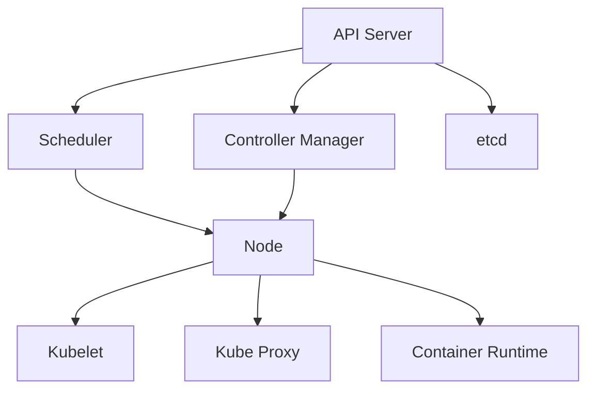

# Kubernetes 架构教程

## 1. Kubernetes 核心组件

Kubernetes 由以下核心组件构成：

- **Master 节点**:
  - API Server: 集群的入口，处理所有 REST 请求
  - Scheduler: 负责将 Pod 调度到合适的 Node 上
  - Controller Manager: 管理各种控制器
  - etcd: 分布式键值存储，保存集群状态

- **Node 节点**:
  - Kubelet: 与 Master 通信，管理 Pod 生命周期
  - Kube Proxy: 维护网络规则，实现服务发现和负载均衡
  - Container Runtime: 如 Docker，负责运行容器

## 2. 核心概念

- **Pod**: Kubernetes 的最小部署单元，包含一个或多个容器
- **Deployment**: 定义 Pod 的部署策略
- **Service**: 为 Pod 提供稳定的网络访问
- **Namespace**: 资源隔离和分组

## 3. 示例解析

参考 `k8s学习/实操记录/k8s_demo/` 目录下的示例文件：

- `deployment.yaml`: 定义应用部署
- `service-hellok8s-clusterip.yaml`: 定义 ClusterIP 类型的服务
- `ingress.yaml`: 定义外部访问规则

## 4. 架构图

## 5. 最佳实践

- 使用 Deployment 管理 Pod
- 通过 Service 暴露应用
- 使用 ConfigMap 和 Secret 管理配置
- 设置资源限制和请求
- 使用 Namespace 隔离环境

## 6. 参考资料

- [Kubernetes 官方文档](https://kubernetes.io/docs/home/)
- [Kubernetes 架构概述](https://kubernetes.io/docs/concepts/overview/components/)
